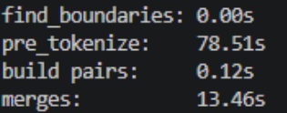
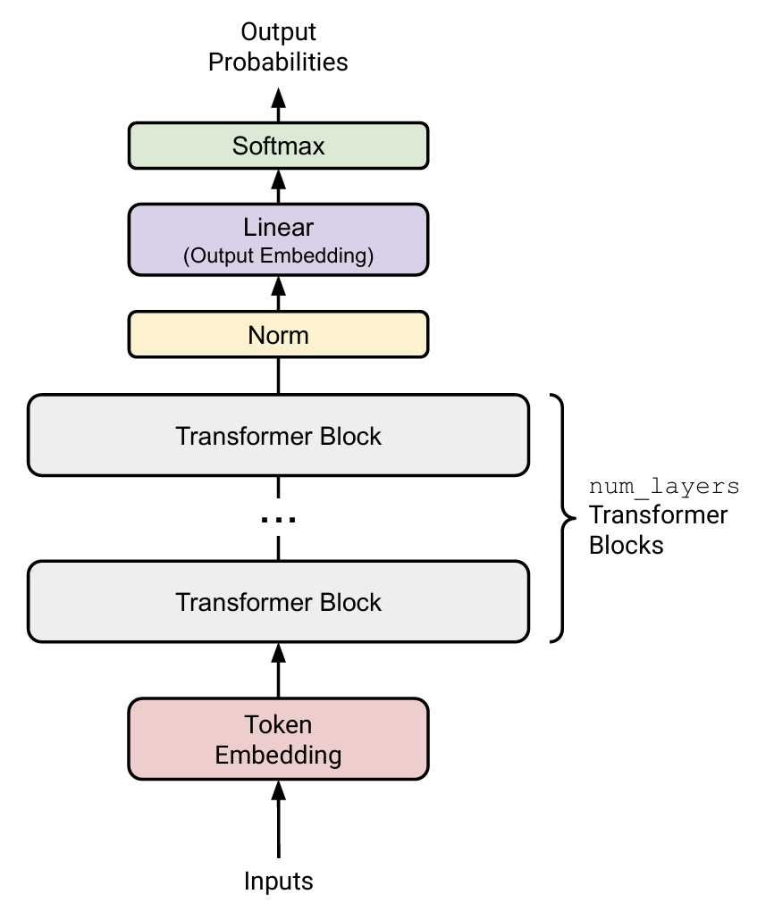

# BPE tokenizer
## 介绍
BPE tokenizer，即字节对编码分词器。它主要的作用就是把一段文字映射成一段数字，然后这段数字会成为神经网络的输入。它主要解决的问题就是映射表-tokenize后的序列长度的权衡问题。

比如如果每个字都转为字节序列然后输入神经网络，映射表非常短，但输入序列太长了，对于O(n^2)的复杂度，这会导致时间急剧增加。

又比如每个单词映射为一个数字输入神经网络，输入序列短了，但是构建这个映射表非常困难，而且肯定会有未被收录的单词只能当作unknown token，这也不是一个很鲁棒的解决方案。

接下来就具体说说BPE tokenizer究竟是怎么做的。
## 训练阶段
首先来讲BPE tokenizer的训练。这里以Byte-level BPE为例，且只是最简单的实现。

简而言之，训练做的事就是
**1**、先用utf-8编码文字，得到一串0-255的数字（由于utf-8编码后很多无法显示，业界会做一次Byte-to-Unicode 映射，来保证 Token 的可见性。这样便于观察结果）

**2**、然后进行循环：
	（1）统计这串数字相邻两个数字对出现的频率。比如 \[1,2,3,4] 这串东西，统计结果就是（1，2）出现一次，（2，3）出现一次，（3，4）出现一次。
	（2）合并出现频率最高的数字对，并在映射表中为其分配一个新的数字。比如256 ->（3，4）。
	（3）更新统计表和数字列表，比如上述例子中数字列表就变为 \[1，2，256] ，统计表就变为（1，2）出现一次，（2，256）出现一次。
	
**3**、没了

就这么简单。但是还有几个小问题，可以讨论一下
### 为什么用utf-8？
因为utf-8兼容性好，而且省空间。像utf-32这种编码完会出现大量的0，浪费空间。

### 对于汉字字符这种普遍要3字节的东西如何运行？
先看utf-8编码，它是prefix coding，首先确保了编码后的东西的唯一性。然后就是合并阶段。现代的tokenizer有严密的**正则匹配**和**预切分**来防止出现两个汉字间的byte被合在一起成为无意义token的情况，所以实际上它基本上是很快的从字节粒度跨越到字符粒度，再进行进一步的合并。

### Special Token
会有<|endoftext|>这种应当被当作一个token且不希望被合并的token，处理它们的方法就是直接在映射表里为它们赋上数字，然后把它们从文本里去掉，并以它们为切分点把前后文本切分，不考虑这两段文本间的合并（因为special token大多都要切断前后的逻辑，通常来说它们前面和后面的文本连不起来）

### 如何优化？
可以发现，如果每次合并后都重新统计一次数字对表的话，需要消耗的时间很长，效率极低。因此有几个小优化可以提升效率。
**（1）chunk & pre-tokenization**
这一步主要解决最初的pair dict如何快速生成。首先，我们可以利用处理完Special Token后留下来的文本段。由于这些段相互无关，完全可以并行统计pair的数量。此为优化一。

接着就是pre-tokenization。我们利用一个经验的正则匹配（比如——
```
PAT=r"""'(?:[sdmt]|ll|ve|re)| ?\p{L}+| ?\p{N}+| ?[^\s\p{L}\p{N}]+|\s+(?!\S)|\s+"""
```
将文本段拆成大概是单词大小的小段 **(pre-token)**，然后统计这些pre-tokens的出现次数，记录进dict里，后续所有pair的统计仅考虑这些pre-tokens内的，不考虑pre-tokens间的。这样只需要对每个pre-token进行pair统计，然后乘以此pre-token出现的次数合并到总的计数表中即可。

显而易见的，重复的”单词“越多，pre-tokenization优化力度越大。此为优化二

**（2）索引预处理**
由于每次合并之后我们都要找到合并的那些pair的位置更新各种列表/字典，很自然的想法就是记录每个pair究竟在哪里出现过。业界使用双向链表和哈希表实现这一点：

将语料库表示为一个巨大的**双向链表**，每个节点是一个 Byte。 2. 建立一个 **Hash Map**，存储所有相邻对（Pair）及其出现的频率和在链表中的位置指针。

当合并 A + B -> AB 时，你只需要根据哈希表里的指针，跳转到语料中 A 出现的位置，修改其前后的链接关系。你**不需要扫描全量文本**，只需要局部更新受影响的相邻对即可。

**（3）批量合并**
对于那些频率高（必须是所有频率前k高的，k视实际overlap情况调整）的，若它们中不含相同字节，可以批量合并，并行处理。

### 迷思
我感觉BPE tokenizer的训练和Hoffman编码非常像啊，只不过BPE考虑了文字的时序逻辑改为统计相邻pair出现的次数。

### 附
依CS336作业要求，我统计了一下各阶段的时间（这次训练的数据集是TinyStoriesV2-GPT4-train.txt，一个约2GB的文本文件，而最终vocabulary集的大小是10000，也即merge了9740次左右，num_workers=10）：

可见在这种规模下pre-tokenize比较消耗时间，故必须并行处理提高效率。
而这次训练后合并出的最长token为' accomplishment'，可见还是有意义token。


训练阶段基本就这样了，接下来是它如何编码和解码。
## 编码
编码阶段要做的就是输入一串字符串，利用训练阶段得到的vocabulary和merges将这个字符串转换为list\[int] 。具体的操作也很简单：

**1**、pre-tokenization，将原先的长文本以和训练时相同的规则切分为pre-tokens，后续的操作均只能发生在pre-tokens内而不能发生在pre-tokens间。

**2**、将这些pre-tokens按bytes用vocab中的编码得到一串数字列表。

**3**、**按照merge中的顺序**将列表中能合的pair一对一对合起来，直到无法合成。举个例子，假设我的字符串经过utf-8编码得到 \[ 1 , 2 , 3 , 4 ] 这个列表，而我的merges长这样：\[ ( 3 , 4 ) , ( 2 , 5 ) , ( 1 , 4 ) ] ，那步骤就是 \[ 1 , 2 , 3 , 4 ] ->合并3、4-> \[ 1 , 2 , 5 ] ->合并2、5-> \[ 1 , 6 ] ，结束。

这样便得到了最终编码完的数字列表。而这个阶段也有几个细节：


### Special Token
对于special tokens，操作形同训练时：将其作为分界，把原文本分为很多chunk，这些chunk再分别用正则表达式去匹配切分，得到pre-tokens，最后按顺序将这些pre-tokens和special token加进一个list里，就算完成了考虑special token的pre-tokenization

### 优化
与训练阶段同样的，编码阶段也有几个可以优化的点。
**（1）** 由于查找时经常需要用bytes去找对应的int，可以引入一个byte_to_id字典，它其实就是vocab反过来：
```
self.byte_to_id = {v: k for k, v in self.vocab.items()}
```
一开始将pre-tokens转换为数字列表时其实也是查的byte_to_id表

**（2）** 引入merge_map：dict \[ tuple\[ int , int ] , int ] 。由于merges原来的类型只是list\[tuple\[bytes, bytes]]，无法快速从一个数字列表得知哪些pair能合并，合并后生成的bytes又对应哪个数字，所以要引入一个能知道两个int合并生成什么int的表。代码如下：
```
self.merge_map = {}

        for i, (p0, p1) in enumerate(merges):

            id0 = self.byte_to_id[p0]

            id1 = self.byte_to_id[p1]

            # 拼接 bytes，去 byte_to_id 查它真实的 ID

            combined_bytes = p0 + p1

            self.merge_map[(id0, id1)] = self.byte_to_id[combined_bytes]
```

**（3）** 缓存。当一个token反复出现时，如果每次都对它重新进行一遍合并操作效率较低。此时若有缓存中存储一些token对应的数字列表就可以大大提升效率。不过鉴于这个对于小规模的bpe提升不明显，我就没有使用。

## 解码
解码非常简单，就是将数字通过vocab换回bytes再用utf-8解码即可。
```
def decode(self, ids: list[int]) -> str:

        ans=b''

        for i in ids:

            ans+=self.vocab.get(i)

        return ans.decode('utf-8',errors='replace')
```


这样一个BPE tokenizer就彻底完成了。


# Transformer From Scratch
作业的这一部分基本就是在从各种小模块开始逐步构建Transformer。后面直接按作业要求的模块实现顺序来写，不一定很有逻辑。

## Embedding
BPE Tokenizer会将词汇映射到数字，而embedding会通过训练给每个数字分配一个d_model维的向量（也即一个**Float\[Tensor, "vocab_size  d_model"]** 型的张量），作为后续真正放进神经网络里的东西。forward即输入一个**Int\[Tensor, "..."]** ，通过对每个数字查embedding_matrix，最终输出**Float\[Tensor, "...  d_model"]**

## RMSNorm
进行Root Mean Square Layer Normalization。公式为$$ \text{RMSNorm}(a_i) = \frac{a_i}{\text{RMS}(a)} g_i, $$
其中$$ \text{RMS}(a) = \sqrt{\frac{1}{d_{\text{model}}} \sum_{i=1}^{d_{\text{model}}} a_i^2 + \epsilon}. $$
也即真正需要训练的参数是**Float\[Tensor, "d_model"]** 型的向量g，而$\epsilon$为一个超参数，一般定为 1e-5（它实际上只是为了防止$RMS(a)$这个分母为0）。forward的操作即为算出$RMS(a)$后进行逐元素计算，得到一个**Float\[Tensor,"...  d_model"]**

## Position-Wise Feed-Forward Network
这部分是一个典型transformer层的最后一部分，负责进一步处理attention后的数据。作业中实现的是SwiGLU，而它的操作是$$ \text{FFN}(x) = \text{SwiGLU}(x, W_1, W_2, W_3) = W_2(\text{SiLU}(W_1 x) \odot W_3 x),  $$
其中$$ \text{SiLU}(x) = x \cdot \sigma(x) = \frac{x}{1 + e^{-x}} x \in \mathbb{R}^{d_{\text{model}}},$$
$$W_1, W_3 \in \mathbb{R}^{d_{\text{ff}} \times d_{\text{model}}}, W_2 \in \mathbb{R}^{d_{\text{model}} \times d_{\text{ff}}}, \text{ and canonically, } d_{\text{ff}} = \frac{8}{3} d_{\text{model}}.$$

先介绍它的背景思想GLU$$ \text{GLU}(x, W_1, W_2) = \sigma(W_1 x) \odot W_2 x, $$
其中$\odot$为逐元素积。

GLU中，可以将$W_2 x$理解为线性处理后的结果，保留了输入信息的特征。而 $\sigma(W_1 x)$则作为门控，通过逐元素积控制特征是否通过。

再回看SwiGLU，即是升维后运用GLU思想，最后再降维，完成一个FFN操作。用SiLU是为了解决Sigmoid在x太大时会遇到的梯度消失问题，同时对比ReLU又在 $x$ 接近 0 的负值区域有一个微小的“凹陷”，使其能保留一部分负向信息，提升模型能力。

## RoPE
Rotary Position Embeddings，即通过'旋转'向量来做到在向量中编入token在序列中位置信息的一种手段。
**输入**为一个**in_query_or_key：Float\[Tensor, "...  sequence_length  $d_k$"]** 和一个**token_positions：Int\[Tensor, " ...  sequence_length"]**。
其中 **...** 一般为batch_size，而seq_length即为token序列中token的数量，$d_k$为一个token在embedding后的维数，token_positions表示每个token的位置。
**输出**为一个和**in_query_or_key**相同形状，含义相同，只不过经过了RoPE的张量。

具体操作如下：

**(1)** 首先计算频率因子$$ \theta_{k} = \frac{1}{\Theta^{(2k-2)/d_k}} \text{ for } k \in \{1, \dots, d_k/2\} ，$$
其中$\Theta$为超参数，得到一个有$d_k/2$项的数列，记为inv_freq（向量）。

**(2)** 接着将inv_freq和token_positions基于广播机制相乘得到一个形状为\[Tensor, " ...  sequence_length  $d_k/2$"] 的张量（**也即对token_positions中每个元素i，将其换成i * inv_freq这一向量**）。记这个张量为angles。至此我们就完成了标准的$$ \theta_{i,k} = \frac{i}{\Theta^{(2k-2)/d_k}} \text{ for } k \in \{1, \dots, d_k/2\} $$
**(3)** 对于$token^i$ （i表示token在token_positions中的那个位置），我们将其序列中的数两两相邻的分为一组，即$token^i_{2k-1}$和$token^i_{2k}$为一组。对他们进行旋转操作，即乘上$$ R_k^i = \begin{pmatrix} \cos(\theta_{i,k}) & -\sin(\theta_{i,k}) \\ \sin(\theta_{i,k}) & \cos(\theta_{i,k}) \end{pmatrix} \tag{8} $$
这一步的实际做法是将in_query_or_key最后的$d_k$维拆成偶半片和奇半片，并与angels.cos()和angles.sin() （即angles进行逐元素cos/sin的结果）进行一些相应的逐元素操作，最后再将两半拼回。代码：
```
        cos_emb = angles.cos()  # [B, S, d_k//2]
        sin_emb = angles.sin()  # [B, S, d_k//2]

        # 应用 RoPE 旋转
        x1 = x[..., 0::2]   # 偶数索引元素
        x2 = x[..., 1::2]   # 奇数索引元素

        o1 = x1 * cos_emb - x2 * sin_emb
        o2 = x1 * sin_emb + x2 * cos_emb

        # 我们需要交错排列以匹配原始 x 的 [0,1,2,3...] 结构
        out = torch.stack([o1, o2], dim=-1).flatten(-2)
```
out即为最终结果。


可以发现，旋转的度数与token位置和pair在embedded_token中的位置都有关。其中pair在embedded_token中的位置对频率因子的影响不受token改变而改变，可以理解为token内部不同位置”频率“不同，然而所有token内部同一位置的”频率“是相同的。频率高的随token位置变化循环得快，对位置极其敏感，负责捕捉**局部语法**。频率低的则旋转缓慢，负责捕捉**全局语义**。在训练时，Wq及Wk会学到如何将信息的不同特征分配到query及key内部的不同频率的位置，以实现良好的效果。

这基本就是RoPE的原理和思想了。

## Scaled Dot-Product Attention
$$
\text{Attention}(Q, K, V) = \text{softmax}\left( \frac{QK^T}{\sqrt{d_k}} \right) V
$$
对第i维softmax时由于数值较大时exp会爆，一个技巧是先将所有值减去第i维的最大值，使新的最大值为0再进行计算。

同时有时会想对$\frac{QK^T}{\sqrt{d_k}}$进行mask，此时一般传一个形状相同的bool张量，而习惯上True的位置代表允许此位置数据通过，False则不允许。这样的话把$\frac{QK^T}{\sqrt{d_k}}$里False对应位置的值替换为-inf即可让该位置在softmax后为0，做到mask。

## Causal Multi-Head Self-Attention
这是Transformer架构中的核心。它的基本步骤是：（有些矩阵乘法顺序不一定对，理解即可）

**(1)** 层内有$$ W_Q \in \mathbb{R}^{hd_k \times d_{\text{model}}}, W_K \in \mathbb{R}^{hd_k \times d_{\text{model}}}, W_V \in \mathbb{R}^{hd_v \times d_{\text{model}}}, W_O \in \mathbb{R}^{d_{\text{model}} \times hd_v} $$
四个权重矩阵。输入**x：Float\[Tensor, " ...  sequence_length  d_model"]** ，先通过$$ Q = W_Q x, \quad K = W_K x, \quad V = W_V x , $$
其中$$ Q \in \mathbb{R}^{seq \times hd_k}, \quad K \in \mathbb{R}^{seq \times hd_k }, \quad V \in \mathbb{R}^{seq \times hd_v } $$
得到Q , K , V三个张量。

**(2)** 将QKV的最后一维分成h份，得到$$ Q_i \in \mathbb{R}^{seq \times d_k}, \quad K_i \in \mathbb{R}^{seq \times d_k }, \quad V_i \in \mathbb{R}^{seq \times d_v } ,i \in [1,h]$$
实际操作中，就是通过rearrange将hd拆分为h * d，再将h这一维提到seq前面当作batch。
接着**对$Q_i$和$K_i$ 进行RoPE**，因为Q、K是要区分位置的。

**(3)** 使用刚写好的Scaled Dot-Product Attention进行$$ \text{Attention}(Q_i, K_i, V_i)  $$
这一步注意要有因果掩码，**第i个query只能看到位置j<=i的key**。（通过torch.triu构造mask作为参数传入Scaled Dot-Product Attention函数即可）
得到的结果最后三维形状应当是$h$  $seq$  $d_v$ .  这时再rearrange一次，把$h$放回$seq$后和$d_v$乘起来，就将切分后的各个块拼回了$\mathbb{R}^{seq \times hd_v}$，记这个结果为O。

**(4)** 最后再将Wo与O相乘，输出一个$\mathbb{R}^{seq \times d_{model}}$，即为多头注意力层的最终输出。

在实际操作中，通常会合并Wq、Wk、Wv为Wqkv，这样可以一次乘法得到QKV，再split一次就行，效率高一点。

## Transformer Block
这里transformer block的结构采取pre-norm。其forward计算步骤为：
1、$$x_{middle} = x + \text{MultiHeadSelfAttention}(\text{RMSNorm}(x))$$
2、$$y = x_{middle} + \text{FFN}(\text{RMSNorm}(x_{middle}))$$

## The Full Transformer LM

完整的Transformer LM依照这个实现即可，将之前写过的模块拼起来就完成了！