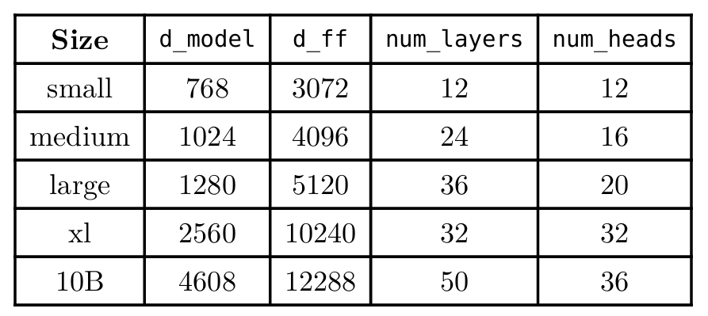
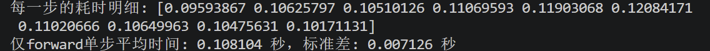
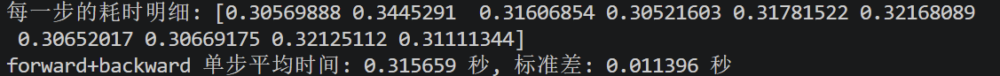
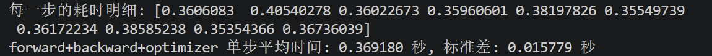
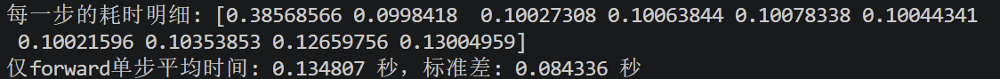
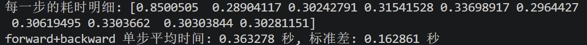
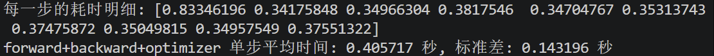
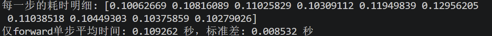
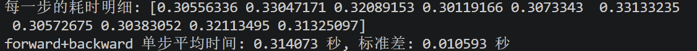
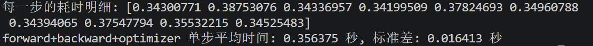

# Profiling and Benchmarking
## End-to-End Benchmarking
本作业是要写一个脚本用于测量transformer各步需要花的时间。由于backward和optimizer无法独立存在，我们测量三种时间：只forward；forward+backward；forward+backward+optimizer。
这是作业要求测试的各种大小。然而由于没卡，我只测了small model。

首先是**跑5轮warm up，接着跑十轮测试**（warm up不计入时间）：

可以发现，时间上backward>forward>optimizer，且forward+backward的时间大致是仅forward的3倍，也即**backward的时间大致是forward的两倍**，符合理论计算flops的结果。

接着是**无warm up，直接跑十轮测试**（即cold start）：

不难发现无warm up时**第一步耗时较长，后面都与上一次实验基本一致**。这是由于warm up时要建立内存池，编译核函数等等，而现在没有warm up步，这些都在测试的第一步完成，因此第一步耗时明显长。
而且，仅forward的cold start速度快很多，接近快了0.5秒。这是因为**仅forward的时候使用了no_grad**，需要开辟的内存空间少了，也不需要那些追踪梯度的指针和图，编译的Kernel也更精简。

最后是**2轮warm up，接着跑十轮测试**（稍微减少warm up观看效果）：

可以预见地，结果和warm up五轮时差不多。（因为上一次实验已经说明small model条件下基本只用一轮warm up就行）

**注意：测量仅forward时必须开no_grad**：因为在pytorch逻辑中，若不开no_grad，forward时会记录一张激活图，而backward则顺着这个激活图算梯度，一边算一边清除这个图。在forward+backward与forward+backward+optimizer中都进行了backward，故每轮这张图都会被清除。然而仅forward时这张图不会被backward清除，每轮还都会产生新的图，因此跑几轮显存就爆了。因此必须开no_grad，这样计算时不会产生这个图，显存也就不会爆了。