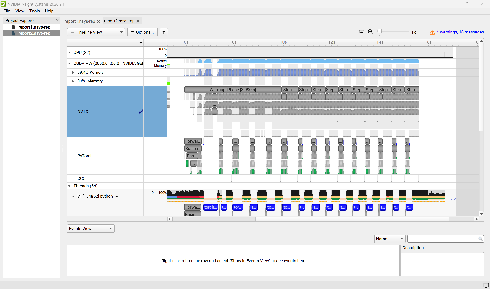
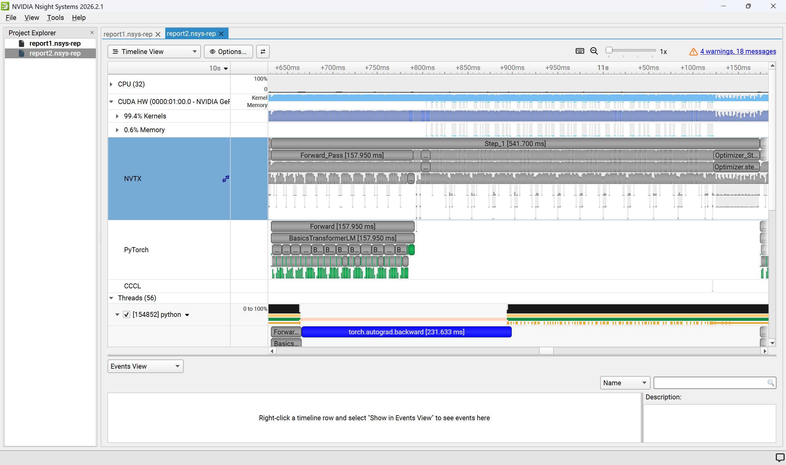
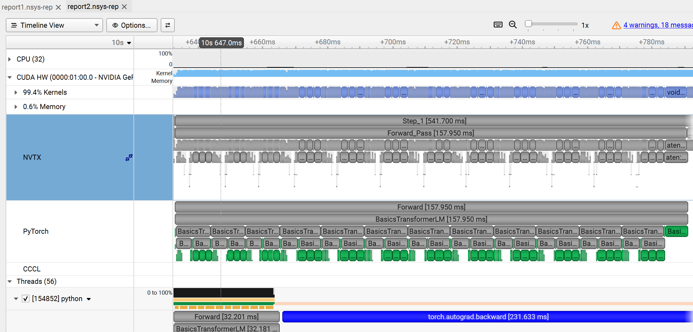
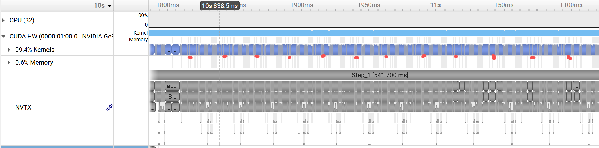
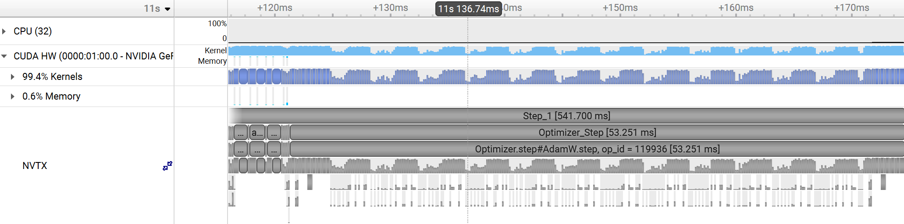
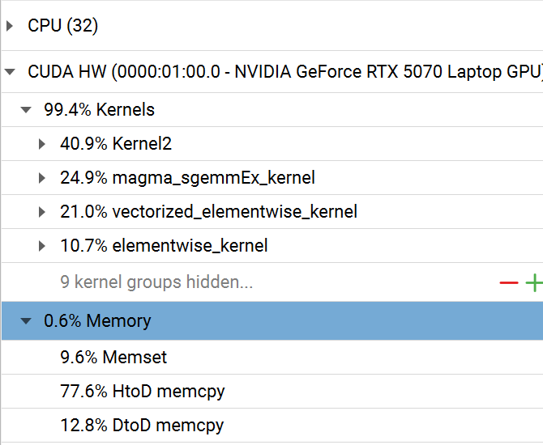

# Profiling and Benchmarking
## End-to-End Benchmarking
本作业是要写一个脚本用于测量transformer各步需要花的时间。由于backward和optimizer无法独立存在，我们测量三种时间：只forward；forward+backward；forward+backward+optimizer。
这是作业要求测试的各种大小。然而由于没卡，我只测了small model。

首先是**跑5轮warm up，接着跑十轮测试**（warm up不计入时间）：

可以发现，时间上backward>forward>optimizer，且forward+backward的时间大致是仅forward的3倍，也即**backward的时间大致是forward的两倍**，符合理论计算flops的结果。

接着是**无warm up，直接跑十轮测试**（即cold start）：

不难发现无warm up时**第一步耗时较长，后面都与上一次实验基本一致**。这是由于warm up时要建立内存池，编译核函数等等，而现在没有warm up步，这些都在测试的第一步完成，因此第一步耗时明显长。
而且，仅forward的cold start速度快很多，接近快了0.5秒。这是因为**仅forward的时候使用了no_grad**，需要开辟的内存空间少了，也不需要那些追踪梯度的指针和图，编译的Kernel也更精简。

最后是**2轮warm up，接着跑十轮测试**（稍微减少warm up观看效果）：

可以预见地，结果和warm up五轮时差不多。（因为上一次实验已经说明small model条件下基本只用一轮warm up就行）

**注意：测量仅forward时必须开no_grad**：因为在pytorch逻辑中，若不开no_grad，forward时会记录一张激活图，而backward则顺着这个激活图算梯度，一边算一边清除这个图。在forward+backward与forward+backward+optimizer中都进行了backward，故每轮这张图都会被清除。然而仅forward时这张图不会被backward清除，每轮还都会产生新的图，因此跑几轮显存就爆了。因此必须开no_grad，这样计算时不会产生这个图，显存也就不会爆了。

## Nsight Systems Profiler
在看具体profile结果前，先看一下几个常见的东西是什么意思：
**(1)** **Kernel**: 在 CUDA、Triton 和 OpenCL 等并行计算中，**Kernel（核函数）** 一般表示一个由CPU发射、在GPU上并发执行的、无返回值的 C++/原生函数。它是 GPU 硬件并发调度的最小软件单元。

**(2)** **以aten开头的东西**，如aten::einsum; aten::exp等等。这些是PyTorch 后端（C++）的底层特化算子，作为 Python 顶层框架与底层硬件原生 Kernel（CUDA/CUDNN）之间的中间桥梁。

**(3)** **一长串带有各种参数(如dtype、tile大小）的名字**，如void magma_sgemmEx_kernel<float, float, float, (bool)1, (bool)0, (int)6, (int)4, (int)6, (int)3, (int)4>(int, int, int, BatchedTensor, int, BatchedTensor, int, BatchedTensor, int, BatchedTensor, int, int, int, const T1 \*, const T1 \*, T1, T1, int, cublasLtEpilogue_t, int, const void \*, long)。**这个是 GPU 真正执行的底层原生核函数（Native CUDA Kernel）的修饰名**。可以通过它的名字看出这一步究竟在干啥。现代高性能计算后端（如 cuBLAS、CUTLASS、MAGMA）具有极高强度的特化性。面对同一种数学运算（如matmul），编译器与运行时分发机制会根据动态输入张量的形状、内存对齐方式以及当前 GPU 的架构特性，**动态路由并调用完全不同的启发式特化内核**。

依照作业要求使用Nsight Systems Profiler对上一个作业中的脚本运行进行监测。得到结果如下图：

这张图可以主看NVTX部分。先深入比如step1来看看一个step中的操作反映在硬件上长什么样。

Forward_Pass与Optimizer_Step中间即为Backward。可以发现与粗测中得出的Backward时间基本为Forward两倍；Optimizer最快的结论一致。当然只这么看还看不明白，可以接着放大看。

**(1)**：Forward

可以在PyTorch中看到，Forward耗时的操作就是12层BasicsTransformer的计算，以及最后一个大的lm_head的计算。在Transformer中又可以分为前期的Attn和后面的FFN两类。可以发现FFN对应底下有三个大的绿色矩形，这就是SwiGLU中的三个大的矩阵乘法。而Attn对应的Kernel就细碎很多，这也符合Attn中操作繁杂的特点。

展开Attn，可以看到前三个耗时较长的对应QKV的产生（也是矩阵乘法），最后耗时长的是和output_proj乘。中间两个没那么耗时的位于positional encoder步，应当是在RoPE中按奇偶分片后的计算步（因为有很多elementwise kernel，同时最后有一步cat kernel）。

**(2)**：Backward

看Backward。不难发现点出的十二个点处都有三个耗时稍长的，应当对应FFN的梯度计算。而在第一个红点前还有个较耗时的，可以推测为lm_head的backward步，因为backward时顺序与forward相反。

**(3)**：Optimizer

Optimizer步没啥特别耗时的单步，这是因为没有大的矩阵乘法，点开看的话都是一些elementwise kernel，这也符合Optimizer中更新权重计算的特征。从CUDA HW也明显能看出一个pattern重复了12次，符合12层这一超参数。

**(4)** ：接下来还有一个能看的是各Kernel耗时分布：

可以发现elementwise_kernel加起来占了31.7%，属于较高的比例。这与跑的模型非常小有关系。在正常大小的模型中，一般矩阵乘法耗时占比会再高一些。

## Mixed Precision
在实际训练时，我们一般不会拿全精度（FP32）跑所有流程。一是由于现代的GPU对于低精度运算有做优化加速（如B200运算FP32有80TFLOPS，而运算BF16达到了2500TFLOPS！），二是这节省空间。
然而也不能全拿低精度算。在有些地方，全精度是必要的。如梯度下降时，有些小梯度在BF16里会被直接截断成0，而这不是我们想要的结果。总的来说，在需要累计的地方（optimizer——权重微量累加、softmax——指数累加 等等）使用高精度是不错的选择。
