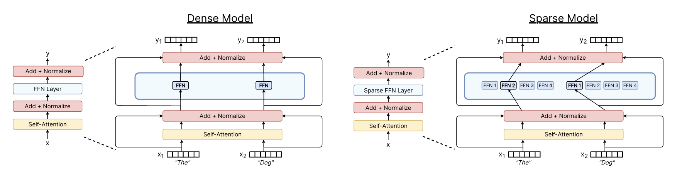
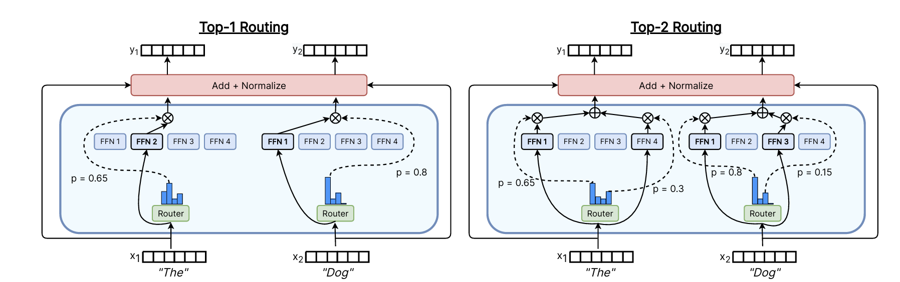

MoE架构主要改进了FFN层。原本FFN只是一个块，而在MoE中，FFN层变成很多并列的块，通过在FFN层前的router决定每次forward使用哪几个块计算（即哪几个'专家'）。

# 为什么MoE能得到更好的效果
从直觉上解释就是：如果每个FFN块参数量都接近，MoE架构虽然在计算时激活的参数量和原本的Dense Model相近，然而显然拥有多个FFN块的MoE总参数量大得多，参数量大的模型表现自然好。（也可以反过来理解为通过MoE这种架构控制了大参数量模型的激活参数量，使计算更快）

# router怎么工作
## token choice/expert choice
router本质是一个小的线性分类器，里面有一个矩阵$W_{router} \in \mathbb{R}^{d_{model} \times n_{experts} }$ 。每个token与这个矩阵相乘后得到一个$n_{experts}$大小的向量，再经过softmax就得到这个token与每个expert块的匹配度。

token choice就是**让token去选expert**。比如这个token发现它和expert1匹配度最高，它就进expert1这个块进行计算。一般来说不会让每个token只去一个FFN块（感性上理解就是一个token可以有不止一种属性，可以匹配多个expert），所以一般采取top-K，token前往和它匹配度前K高的FFN块。

expert choice就是反过来，**expert选token**。这就需要给expert定一个容量，如100个token。那么就将和这个expert匹配度前100高的token放进里面计算。

然而这两种方法都有点问题。token choice可能出现几个expert接受大部分token而剩下的没有token进入的情况。expert choice在极端情况下则可能有些token没有expert选，有些token被放进太多expert里。

所以当下router都采取了一些措施结合两者优点：
首先是设置**shared expert**。shared expert即一个每个token都要通过的expert，可以防止某些token没被分配到expert。同时也**对每个expert施加capacity限制**，防止token分配太不均匀，当expert达到capacity上限后，后续进入的token都被丢弃不管（其实也有设置fallback的做法，被drop后顺延到下一个expert）。**然后在这两个机制的基础上使用token choice。**

有趣的side effect：由于路由也有不确定性，导致temperature设置为0时模型也不一定每次输出一样的东西。

## router如何训练
router会和整个模型一起通过反向传播进行训练。然而仅仅这样可能训练出一个只会将token分配到少数几个expert的router，让MoE无法发挥其优势，退化为Dense Model。因此有一种做法是引入**辅助损失函数 (Auxiliary Loss)**。

### **第一种：** 
$$loss = \alpha \cdot N \cdot \sum_{i=1}^{N} f_i \cdot P_i $$
其中$$f_i = \frac{1}{T} \sum_{x \in \mathcal{B}} \mathbb{1} \{ \text{argmax } p(x) = i \} $$
$$P_i = \frac{1}{T} \sum_{x \in \mathcal{B}} p_i(x) $$
- **$N$**: 专家的总数量。
- **$T$**: 一个 Batch 中的 Token 总数。
- **$\mathcal{B}$**: 当前训练的 Batch。
- **$\alpha$**: 调节平衡损失权重的超参数。
- **$p_i(x)$**: Router 预测 Token $x$ 进入专家 $i$ 的概率。

可以发现，$f_i$表示token实际上进入$expert_i$的概率。这个公式针对top-1的情况。如果是top-K，由于一个token可进入K个expert，$f_i$还应再除以K。
而$P_i$表示token依照router计算结果进入$expert_i$的总平均概率，是理论概率。

loss函数这么表示有几个原因：
**(1)** f是不可导的，让它与一个平滑可导的P相乘可以使导数能够穿透，可以反向传播。
**(2)** 可以参考f调整P。如果一个f太大，loss要变小就要使对应的P变小，而P变小就更有可能使过大的f变小，起到了调控作用，让分配更平衡。
**(3)** 实际上这个loss函数和常见的均方误差很像，只是稍微改进了一下，变成了f乘P（实际乘理论）。

### **第二种：** 
$$g'_{i,t} = \begin{cases} s_{i,t}, & s_{i,t} + b_i \in \text{Topk}(\{s_{j,t} + b_j \mid 1 \leqslant j \leqslant N_r\}, K_r) \\ 0, & \text{otherwise} \end{cases}$$
其中
-  **$g'_{i,t}$**: Token $t$ 对专家 $i$ 的最终门控值（Gating value）。
- **$s_{i,t}$**: Router 计算出的原始得分（通常是 Token 向量与专家向量的点积）。
- **$b_i$**: 针对专家 $i$ 的**偏置项 (Per-expert bias)**。这是该算法的核心，通过动态调整 $b_i$ 来控制流量。
- **$N_r$**: 路由专家的总数。
- **$K_r$**: 每个 Token 选择的专家数量（即 Top-K 中的 $K$）。

也就是在top-K时加一个偏置项让获得太多token的expert的概率变小，反之变大，来平均expert获得token的数量，之后真正算的时候再移除。

这是DeepSeek-V3使用的技术，非常简洁优美。它相比第一种方法有几个高明之处：

#### **(1) 权重解耦：计算归计算，路由归路由**
 **传统 Aux Loss：** 它在训练时会产生一个梯度，直接修改 Router 的权重。这会导致 Router 为了降 Loss，在计算 $s_{i,t}$（原始得分）时就开始“说谎”。最终得到的 $p_i(x)$ 是被扭曲过的语义匹配度。

**DeepSeek V3：**
**路由选择：** 使用 $s_{i,t} + b_i$。
**实际计算：** 一旦 Token 进入了expert，参与最后加权求和的权重依然是**原始的 $s_{i,t}$**。
**结果：** 虽然 Token 可能因为偏置被迫去了匹配度低一点的expert，但在最后的融合阶段，模型依然知道这个 Token 与该专家的真实匹配度较低，从而通过较小的 $s_{i,t}$ 降低它的贡献。这比强行给它一个高概率要有效得多。

#### **(2)从“静态惩罚”变为“动态反馈”**
**Aux Loss** 像是一个**死板的法律**：不管当下状况如何，只要大家不平均，就惩罚。这种惩罚是全局性的，往往会干扰到那些本来就不该平衡的边缘案例。   

**Per-expert Bias** 像是一个**动态导航系统**：
它采用 **Online Learning**（在线调整）。如果在最近的几个训练步骤中，专家 A 爆满了，就微调一下 $b_A$。        
这种调整是平滑且实时的。它在选择阶段做微小的“导流”。如果某个 Token 对应的 $s_{i,t}$ 实在太高（非常有针对性），即使有 $b_i$ 的阻拦，它依然可以进入那个专家。

#### **(3)** 避免了“梯度冲突”
 在传统 MoE 中，主 Loss（预测 Loss）希望 Router 选最准的，而 **Aux Loss** 希望 Router 选最平均的。这两个Loss的梯度方向可能相反，导致 Router 左右为难，最终训练出来的特征空间是凌乱的。
 **V3 的方案** 移除了 Aux Loss，意味着 Router 的梯度**只来自于预测 Loss**。Router 只需要关注语义匹配即可。至于平衡问题，交给偏置项 $b_i$ 在推理/转发层面上解决。

### 其他
同时，还有一个可以做的是**引入噪声**。这样门控概率计算公式就变为：
$$G(x) = \text{Softmax}(\text{KeepTopK}(H(x), k))$$
其中$$H(x)_i = (x \cdot W_g)_i + \text{StandardNormal}() \cdot \text{Softplus}((x \cdot W_{\text{noise}})_i)$$
$$\text{KeepTopK}(v, k)_i = \begin{cases} v_i & \text{if } v_i \text{ is in the top } k \text{ elements of } v. \\ -\infty & \text{otherwise.} \end{cases}$$
增加这个噪声可以让expert变得更鲁棒，让它们拿到一些不太匹配的数据时也能输出比较合理的东西。同时也可以在训练初期增加一些随机性，让每个expert都分配到各种token，避免'强者恒强'导致一些有潜力的expert受不到训练。

## 推理
推理时就是token根据router通过相应的experts，然后得到的结果根据router当时算出的匹配度加权得到FFN(x)，再加上输入，形成一个标准的残差连接即可。